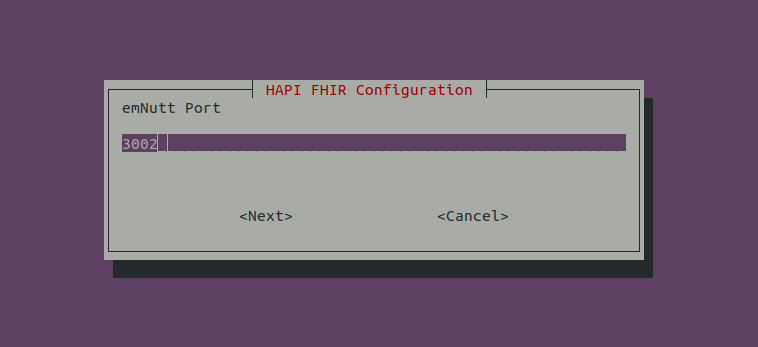
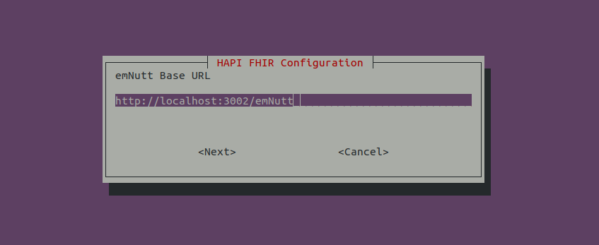
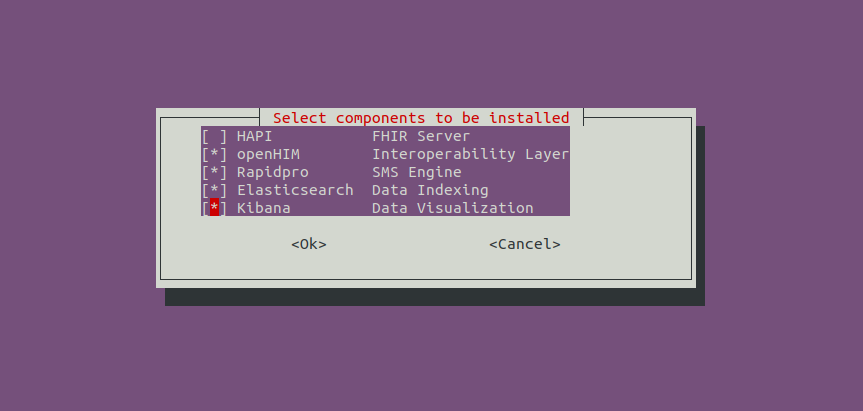
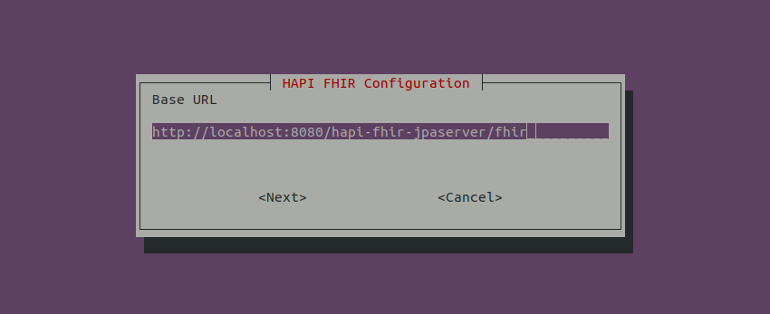

# Docker installation

Clone the repository

```bash
git clone https://github.com/intrahealth/emNutt.git
```

```bash
cd emNutt && sudo ./install.sh
```

The install script will ask some few questions as below

### emNutt port


This is the port number that emNutt server will be listening

### emNutt Base URL

Put base URL that people use to access emNutt. if emNutt is behind any proxy, then it should be the address used to access emNutt through proxy


### emNutt Components

This allows you to select what components that should be installed locally, the installer will ask for url of any unselected components


### url of unselected components

You will be asked for the url, username and password of any component that were not selected from the previous screen


The installer will now pull all docker images for selected components, install them and start the server.
The installer will generate two files,

1. docker_env_vars - This has all environment variables that can be used to configure all the emNutt installed components and emNutt itself. Change them to twist some behaviours of emNutt
2. start.sh - Use this script to start emNutt.

```bash
sudo ./start.sh
```
